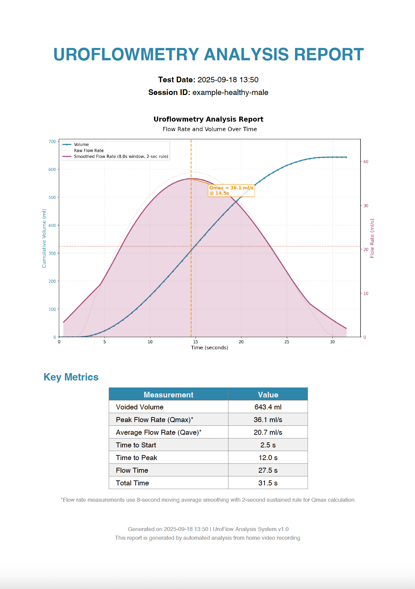
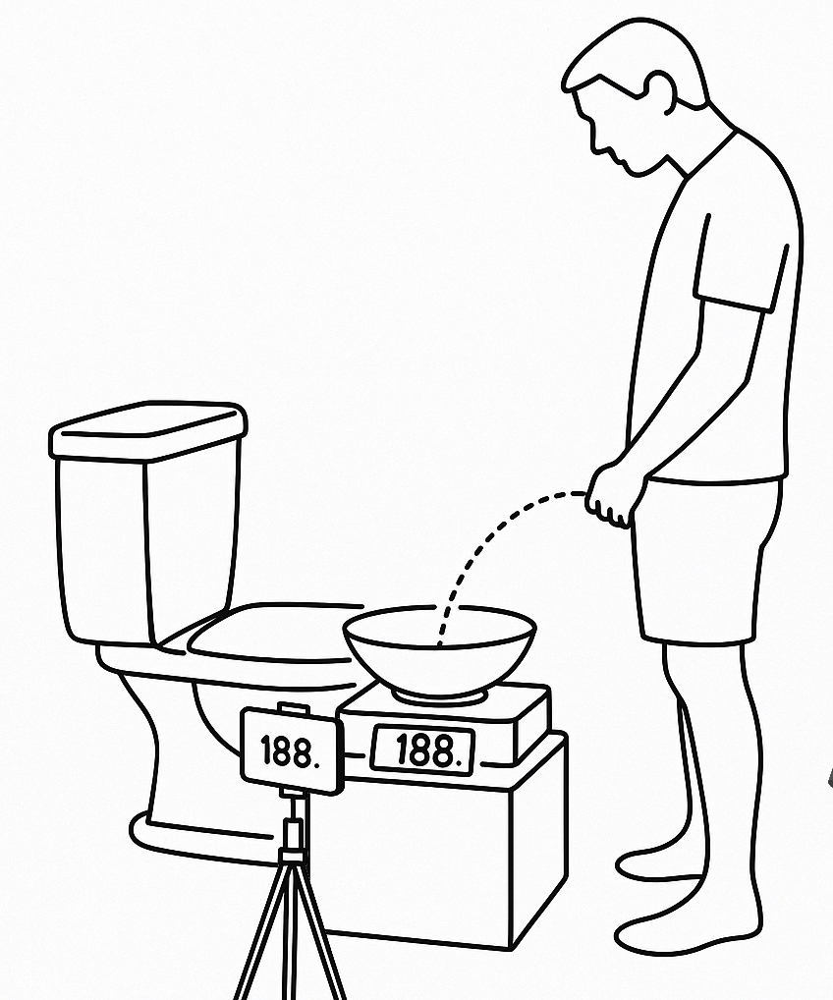
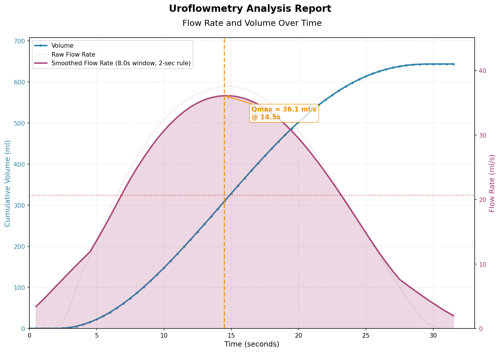

# DIY Uroflowmetry Analysis Tool

A simple system for extracting uroflow measurements from video recordings of a digital scale, providing an accessible alternative to specialized medical equipment.

## Overview

This project enables DIY uroflowmetry testing using commonly available equipment:
- A digital scale to measure collected urine weight
- A camera/phone to record the scale display
- OpenAI's Vision API to extract weight readings from video frames

The tool provides objective flow measurements and visualization without clinical interpretation, suitable for personal tracking or sharing with healthcare providers.


*Sample PDF report showing flow curve analysis and key metrics*

## Workflow

1. **Record**: Video the digital scale display during urination
2. **Process**: Run `./uroflow.py process video.mov` to automatically extract frames, run OCR, and generate analysis
3. **Review**: Check the generated chart, metrics, and PDF report in `~/.uroflow/sessions/`

### Video Recording Guidelines

#### Equipment Requirements
- **Digital scale**: Must have 1g accuracy and display in grams
  - Kitchen scales work well (typically 1g-5000g range)
  - Bathroom scales won't work (insufficient resolution)
- **Container**: Bowl or similar container to collect urine
- **Camera/phone**: Any device capable of recording video

#### Physical Setup
1. **Height positioning**: Place the scale on a chair or toilet lid
   - This brings it to appropriate height for standing urination
   - Prevents splashing and ensures comfortable positioning
2. **Container placement**: Center the bowl on the scale
3. **Zero the scale**: Tare/zero with empty container before recording


*Recommended setup: Scale on toilet lid, bowl centered on scale, camera on tripod focused on display*

#### Recording Tips
- **Lighting**: Ensure good lighting on the scale display
- **Camera position**:
  - Mount or prop your phone/camera to keep it stable (avoid handheld)
  - Frame the shot to capture just the scale display
  - Make sure numbers are clearly readable
- **Audio cues**: Say "start" when beginning and "stop" when finished
  - This helps with accurate video trimming later

#### Example of Good Video Quality


#### Post-Recording
- **Trim the video**: Use your phone's editor to trim from "start" to "stop" audio cues
- **File format**: Save as .mov or .mp4
- **Review**: Check that scale readings are clearly visible throughout


## Key Measurements

The tool calculates and reports:
- **Peak flow rate (Qmax)**: Maximum ml/s achieved (using 2-second sustained rule)
- **Average flow rate (Qave)**: Mean flow throughout voiding
- **Voided volume**: Total amount in ml
- **Time metrics**: Time to start, time to peak, flow time, total time
- **Flow curves**: Both raw and smoothed visualization

## Setup

1. Install dependencies:
   ```bash
   poetry install --no-root
   ```

2. Set your OpenAI API key:
   ```bash
   export OPENAI_API_KEY='your-api-key-here'
   ```

## Usage

### Quick Start: One-Step Processing

```bash
# Process a video file from start to finish
./uroflow.py process video.mov

# You'll be prompted for patient name (optional)
# The system will:
# 1. Create a timestamped session in ~/.uroflow/sessions/
# 2. Extract frames from video (if not already cached)
# 3. Process frames with OCR (if not already done)
# 4. Generate analysis and visualization chart
```

### Session Management

All data is organized in sessions under `~/.uroflow/sessions/`:

```bash
# List all sessions
./uroflow.py sessions

# Work with latest session
./uroflow.py analyze  # Re-analyze latest session
./uroflow.py plot     # Regenerate chart for latest

# Work with specific session
./uroflow.py analyze --session 2024-01-15-143022
./uroflow.py plot --session 2024-01-15-143022-John_Doe
```

### Individual Commands

#### Process Video (Recommended)
```bash
./uroflow.py process input.mov --patient-name "John Doe"
./uroflow.py process input.mov --fps 3  # Custom frame rate
./uroflow.py process input.mov --force  # Force re-processing, ignore all cached data

# With custom concurrency settings (for rate limit management)
OCR_MAX_CONCURRENT=5 ./uroflow.py process input.mov  # Limit to 5 concurrent OCR calls
OCR_MAX_PER_SECOND=2 ./uroflow.py process input.mov  # Limit to 2 requests per second

# With custom smoothing window (for cleaner flow curves)
./uroflow.py analyze --smoothing 8  # Use 8-second smoothing window
./uroflow.py plot --smoothing 10    # Use 10-second smoothing for very smooth curves
UROFLOW_SMOOTHING_SECONDS=8 ./uroflow.py analyze  # Set via environment variable
```

#### Manual Step-by-Step (if needed)
```bash
# 1. Run OCR on existing frames
./uroflow.py read --session latest
./uroflow.py read --force  # Force re-run OCR, ignore cached results

# 2. Analyze data
./uroflow.py analyze --session latest

# 3. Generate chart
./uroflow.py plot --session latest

# 4. Generate PDF report
./uroflow.py report --session latest
```

### CLI Commands

- `uroflow process <video>` - Complete pipeline: video → frames → OCR → analysis → chart → PDF report
- `uroflow sessions` - List all analysis sessions with their status
- `uroflow read` - Process frame images with OCR (uses session management)
- `uroflow analyze` - Analyze data and generate chart (default: latest session)
- `uroflow plot` - Create visualization chart (default: latest session)
- `uroflow report` - Generate professional PDF report (default: latest session)
- `uroflow --help` - Show all available commands

## Output

Each session generates:
- `weight_data.csv`: Time-series weight measurements with frame numbers
- `uroflow_chart.png`: Clean visualization chart showing:
  - Cumulative volume over time (blue line)
  - Raw flow rate over time (dotted line)
  - Smoothed flow rate over time (solid purple line)
  - Peak flow (Qmax) marker with annotation
  - Average flow rate reference line
- `report.pdf`: Professional PDF report including:
  - Patient information (if provided) and test date
  - Embedded flow chart
  - Comprehensive metrics table
  - Smoothing methodology note

### Example Output

Below is an example chart generated from healthy male uroflowmetry data:



**Example metrics from this test:**
- Voided Volume: 643.4 ml
- Peak Flow Rate (Qmax): 36.1 ml/s (healthy: >15 ml/s)
- Average Flow Rate (Qave): 20.7 ml/s (healthy: >10 ml/s)
- Flow Time: 27.5 seconds
- Classic bell-shaped curve indicating normal voiding pattern

## Smoothing Configuration

The tool applies configurable smoothing to reduce measurement noise from frame-by-frame OCR:

- **Default**: 8-second moving average window (optimal for most cases)
- **Light smoothing** (5-6 seconds): Preserves more detail, slightly noisier
- **Heavy smoothing** (10+ seconds): Very smooth curves, may reduce peak values

Configure smoothing:
```bash
# Via CLI parameter
./uroflow.py analyze --smoothing 6.0
./uroflow.py plot --smoothing 10.0

# Via environment variable
export UROFLOW_SMOOTHING_SECONDS=8.0
```

The 2-second sustained rule for Qmax ensures peak measurements represent sustained flow, not momentary spikes.

## Note

Since 1g of urine ≈ 1ml, weight changes directly correlate to volume. Flow rate is calculated as the derivative of weight over time.

## Project Roadmap

### Current Features
✅ Frame extraction from video (ffmpeg)
✅ OCR weight reading via OpenAI Vision API
✅ Flow metrics calculation with smoothing
✅ Dual-curve visualization (raw + smoothed)
✅ CSV data export
✅ Session-based data management in `~/.uroflow/sessions/`
✅ Smart caching (skip completed steps)
✅ One-command processing from video to analysis
✅ Professional PDF reports
✅ Configurable smoothing parameters

### Future Enhancements

#### Standalone macOS Application
- **Goal**: Easy installation without technical prerequisites
- **Features**:
  - Bundle Python, dependencies, and ffmpeg
  - Native macOS app or CLI binary
  - Simple installer (DMG or Homebrew formula)
  - No need for Python/Poetry knowledge
  - Auto-updates for new versions

### Data Organization
```
~/.uroflow/
└── sessions/
    ├── 2024-01-15-143022-John_Doe/
    │   ├── metadata.json          # Minimal: patient name, video hash
    │   ├── frames/                # Extracted frame images
    │   │   ├── frame_0001.jpg
    │   │   └── ...
    │   ├── weight_data.csv        # OCR results
    │   ├── uroflow_chart.png      # Visualization
    │   └── report.pdf             # Professional PDF report
    └── latest -> 2024-01-15-143022-John_Doe/  # Symlink to most recent
```

**Session Status Detection (filesystem-based):**
- Frames extracted: `frames/*.jpg` files exist
- OCR completed: `weight_data.csv` exists
- Analysis done: `uroflow_chart.png` exists
- Report generated: `report.pdf` exists

### Recent Updates

**✅ Performance Optimization: Concurrent OCR Processing**
- Uses OpenAI's native `AsyncOpenAI` client for parallel processing
- Processes up to 10 frames concurrently (configurable)
- Built-in retry logic and exponential backoff
- Achieved speedup: 4-5x for OCR phase

**✅ PDF Report Generation**
- Professional A4 reports with embedded charts
- Comprehensive metrics table
- Test date/time and optional patient name
- Automatic generation during `process` command

**✅ Advanced Smoothing & Analysis**
- Configurable moving average window (default: 8 seconds)
- 2-second sustained rule for Qmax calculation
- Dual visualization of raw and smoothed data
- Proper alignment of peak markers with smoothed curve

